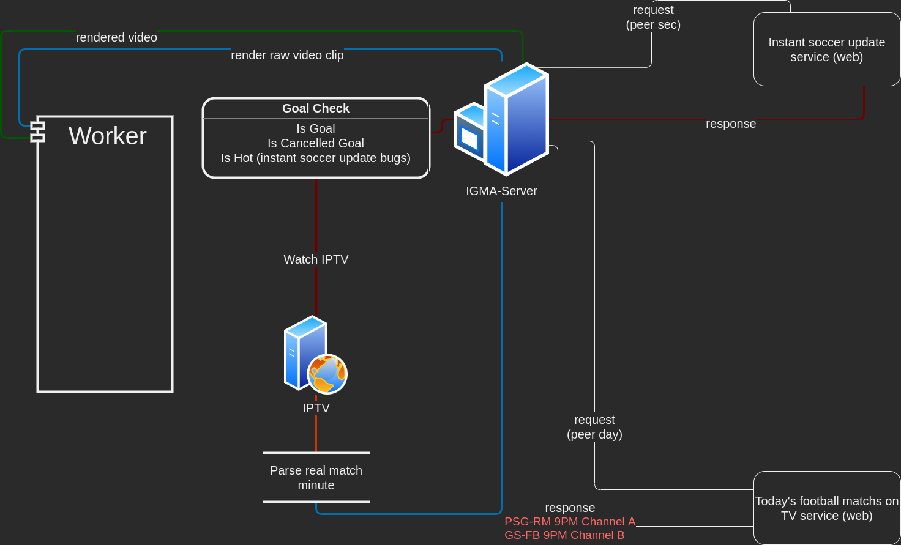

## IGMA-Worker 
### IPTV Goal Monitor Automation WORKER -0.01-

##### -🇹🇷- Hakkında
Iptv futbol yayınlarını takip ederek gol kliplerini çıkartan 2 parçalı **kararsız** yazılım.

###### 3. parti bağımlılıklar
* ffmpeg (subprocess)

###### Eksikler
* Taslak algoritma
* Tekrarlanan kod satırları
* Yetersiz güvenlik önlemleri
* Yetersiz hata kontrolü
* Yetersiz loglama
* Kullanıcı dostu olmayan ayar yapısı

**!! Taslak proje**
#

##### -🇬🇧- About
2-piece **unstable** software that tracks Iptv football (only Turkish) broadcasts and extracts goal clips.

###### 3. party dependencies
* ffmpeg (subprocess)

###### Deficiencies
* Draft algortihm
* Repeated code lines
* Inadequate security measures
* Inadequate logging
* Unfriendly setting types

**!! Draft project**